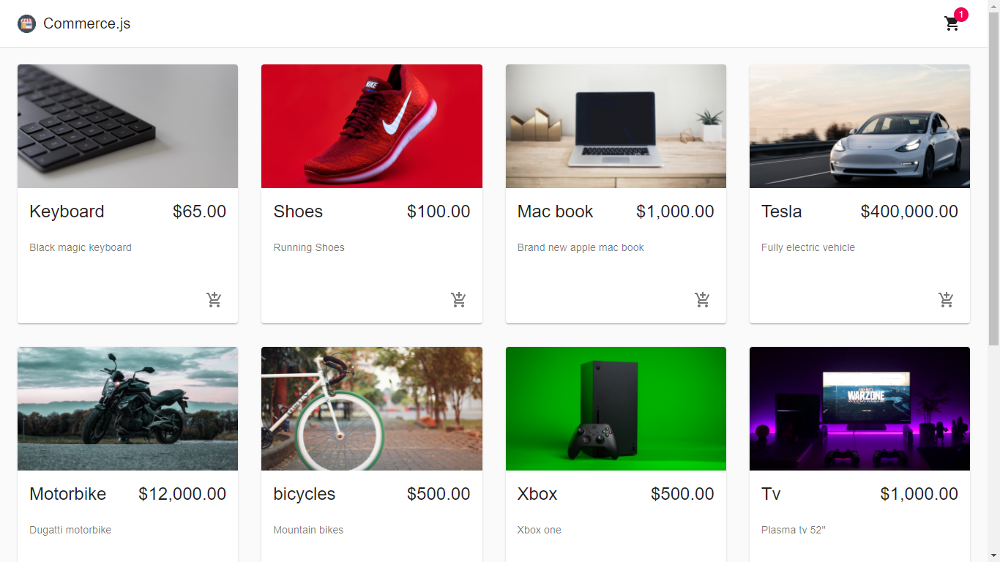

# Commerce Store


## About

In this Commerce application a user can buy products by adding them to the cart and buy them using stripe

To build this application I used:

- Javascript ES6;
- Html/CSS;
- React;
- Commerce.js
- Stripe for payment
- Create React App;
- React-router

## Live-Demo

[The live demo link](https://commerce-store-chi.vercel.app/)

## Screenshots




## Features

- User can add items to cart
- Pay using stripe;


## Getting started (Feature)

To get a local copy of the repository please run the following commands on your terminal:

```
$ git clone https://github.com/RICKCOYL/Commerce-Store.git
$ cd Commerce-Store
$ npm install
$ npm run start 

```

## Launch the application

After making the local copy of the repository:
- get inside the repository folder;
- setup the dependencies of the project: in the terminal run: ```npm install```
- enter the command: ```npm start``` to start the server in localhost.
- then you get the application in the localhost in your web browser.

## Author

👤 **RICK OBURU**

- Github: [@RICKCOYL](https://github.com/RICKCOYL)
- Twitter: [@rickcoyl](https://twitter.com/rickcoyl)
- Linkedin: [Rick Oburu](https://www.linkedin.com/in/rickoburu/)

## 🤝 Contributing

Contributions, issues ,and feature requests are welcome!

## Show your support

Give an ⭐️ if you like this project!

## Acknowledgments

- Hat tip to [stackoverflow](https://stackoverflow.com) community.
- Hat tip to [Create React App](https://github.com/facebook/create-react-app)
- Hat tip to [Vercel](https://www.vercel.com/)

## Issues
If you would like to report an issue [the link](https://github.com/RICKCOYL/Commerce-Store/issues)

## 📝 License

All source code is available jointly under the MIT License.
See [MIT licence](./LICENSE.md) for details.
